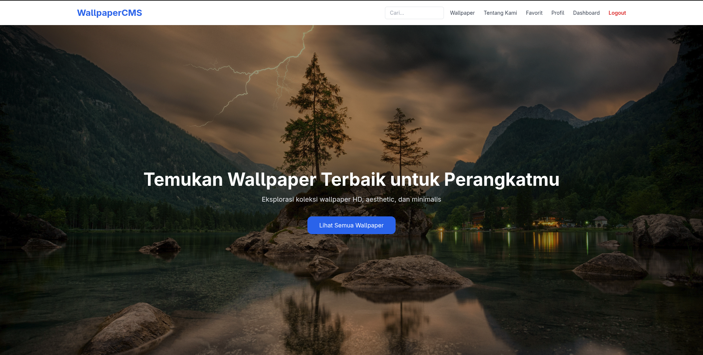
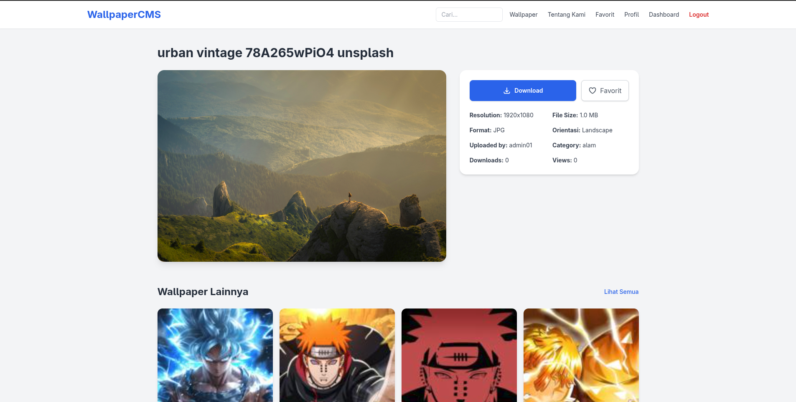
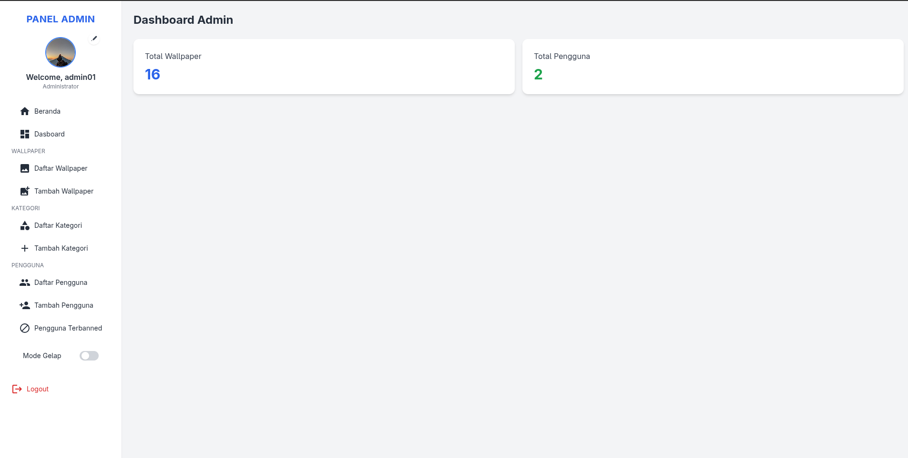

# Wallpaper CMS

> Content Management System untuk koleksi wallpaper digital — dibangun dengan **Django** dan **Tailwind CSS**, dengan dashboard berbasis role dan fitur interaktif yang lengkap.


---

## ✨ Deskripsi

**Wallpaper CMS** adalah aplikasi web untuk mengelola dan menampilkan koleksi wallpaper. Proyek ini dirancang sebagai CMS modular: pengguna dapat menjelajahi galeri, mencari wallpaper berdasarkan tag/kategori/orientasi, menyimpan favorit, serta mengunduh wallpaper. Admin dapat mengelola seluruh konten melalui dashboard yang responsif.

Proyek ini merupakan hasil audit menyeluruh (perbaikan permission, keamanan, dan bug) serta pengembangan fitur interaktif, dan siap dijadikan portofolio.

---

## 📸 Screenshot


| Beranda | Detail Wallpaper | Dashboard Admin |
|:-------:|:----------------:|:---------------:|
|  |  |  |

---

## 🚀 Fitur Utama

**Konten & Galeri**
- 🖼️ **Bulk Upload** — unggah banyak wallpaper sekaligus dalam satu formulir
- 🏷️ Tag & Kategori untuk mengelompokkan konten
- 🔍 **Pencarian Lanjutan** — filter berdasarkan kata kunci, orientasi (Landscape/Portrait/Square), dan rentang waktu
- 📐 Thumbnail otomatis berkualitas tinggi (LANCZOS, kompresi ringan)

**Fitur Interaktif**
- ❤️ **Bookmark / Favorit** — simpan wallpaper favorit pengguna
- 📥 **Download Counter** — setiap unduhan terhitung otomatis
- 🔄 Toggle favorit & regenerasi thumbnail saat gambar diperbarui

**Admin & Keamanan**
- 🛡️ **Role-based dashboard** — hak akses berbeda untuk Admin, Staff, dan User biasa
- 👥 Manajemen pengguna (buat, ban/reactivate)
- 📊 CRUD lengkap untuk Wallpaper, Kategori, dan Pengguna
- 🗂️ Penghapusan file media (gambar + thumbnail) secara aman
- ✅ Validasi upload (ukuran & tipe file)

**Tampilan**
- 🎨 **UI berbasis Tailwind CSS** — modern, responsif, dan mobile-friendly
- 🌙 Dukungan dark mode pada bagian tertentu
- ⚡ Halaman cepat berkat thumbnail & `select_related` / `prefetch_related`

---

## 🛠️ Tech Stack

| Layer      | Teknologi |
|------------|-----------|
| Backend    | Python, **Django 5.2** |
| Frontend   | **Tailwind CSS** (CDN), HTML, JavaScript |
| Database   | **PostgreSQL** (default) / SQLite (opsional) |
| ORM & Tools| Django ORM, `django-taggit`, `django-simple-history`, `django-extensions` |
| API        | Django REST Framework |
| Media      | Pillow (pembuatan thumbnail & validasi gambar) |

---

## 📁 Struktur Proyek

```
wallpaper_cms/
├── backend/
│   ├── api/                 # REST API (IsAdminOrReadOnly)
│   ├── categories/          # Manajemen kategori
│   ├── core/                # Konfigurasi settings, decorators, view root
│   ├── seo/                 # Robots.txt & sitemap
│   ├── templates/           # Template HTML (Tailwind)
│   ├── users/               # Autentikasi & manajemen pengguna
│   ├── wallpapers/          # Modul utama: model, upload, search, favorit
│   ├── media/               # File unggahan (thumbnail otomatis)
│   └── requirements.txt     # Dependensi Python
├── frontend/                # Aset & dependensi frontend
├── .env                     # Konfigurasi environment (JANGAN di-commit)
└── README.md
```

---

## ⚙️ Panduan Instalasi Lokal

### Prasyarat
- Python **3.10+**
- PostgreSQL **14+** (atau gunakan SQLite)
- (Opsional) Node.js untuk frontend

### Langkah 1 — Clone Repository

```bash
git clone https://github.com/username/wallpaper_cms.git
cd wallpaper_cms
```

> Ubah `username` sesuai akun GitHub Anda.

### Langkah 2 — Buat & Aktifkan Virtual Environment

```bash
# Linux / macOS
python3 -m venv venv
source venv/bin/activate

# Windows
python -m venv venv
venv\Scripts\activate
```

### Langkah 3 — Install Dependensi

```bash
pip install -r backend/requirements.txt
```

### Langkah 4 — Konfigurasi Environment

Buat file `.env` di folder `backend/` (atau sesuaikan `core/settings/base.py`) dengan kredensial database Anda:

```env
# backend/.env
SECRET_KEY=your-secret-key-here
DEBUG=True
DB_NAME=wallpaper
DB_USER=postgres
DB_PASSWORD=your-password
DB_HOST=localhost
DB_PORT=5432
```

Jika ingin memakai **SQLite**, ubah `DATABASES['default']['ENGINE']` di `core/settings/base.py` menjadi `django.db.backends.sqlite3`.

### Langkah 5 — Jalankan Migrasi & Server

```bash
cd backend

# Terapkan skema database
python manage.py makemigrations
python manage.py migrate

# Buat superuser (admin)
python manage.py createsuperuser

# Jalankan server pengembangan
python manage.py runserver
```

Buka http://127.0.0.1:8000/ di browser. Dashboard admin dapat diakses di http://127.0.0.1:8000/users/dashboard/ (atau `/admin/` bawaan Django).

> **Catatan:** jalankan perintah dari folder `backend/` karena `manage.py` berada di sana.

---

## 🧪 Menjalankan Test

```bash
cd backend
python manage.py test wallpapers categories users seo
```

Suite berisi **83 unit test** yang mencakup model, permission, CRUD admin, upload, dan fitur interaktif.

---

## 🔐 Keamanan & Best Practices

- Hanya **Admin/Staff** yang dapat mengelola data (`manager_required`)
- Login wajib untuk halaman admin & dashboard
- Validasi ukuran (10 MB) & tipe file (JPG/PNG/WEBP) saat upload
- `SECRET_KEY` dan kredensial disimpan di `.env` (tidak di-commit)
- Anti decompression bomb saat pembuatan thumbnail

---

## 📄 Lisensi

Proyek ini dilisensikan di bawah **MIT License** — lihat file [LICENSE](LICENSE) untuk detail selengkapnya.

---

<p align="center">
  Dibuat dengan ❤️ oleh <strong>Arya Nanda Eka Putra</strong> — © 2026
</p>
